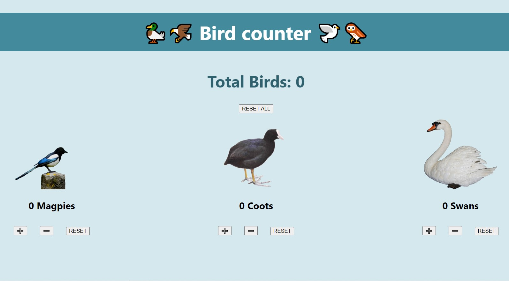

# Bird Counter

This is a little fun project, aimed to help me count birds I see on my walk. Originally it was a team exercise during a React week in [School of Code](https://www.schoolofcode.co.uk/). I later reworked it to fix bugs and add to functionality.

## To run locally:

In the project directory, run:

### `npm start`

Open [http://localhost:3000](http://localhost:3000) to view it in your browser.
